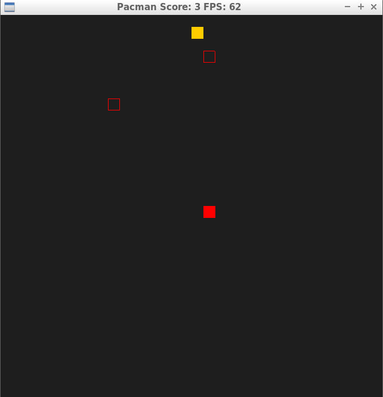

# CPPND: Capstone Pacman Game

This is a submission for the Capstone project in the [Udacity C++ Nanodegree Program](https://www.udacity.com/course/c-plus-plus-nanodegree--nd213).

This this a Pacman-like game. The player need to eat foods to earn score, while avoid the attack from ghost. The player can adjust the game difficulty at start.

## Dependencies for Running Locally
* cmake >= 3.7
  
  * All OSes: [click here for installation instructions](https://cmake.org/install/)
* make >= 4.1 (Linux, Mac), 3.81 (Windows)
  * Linux: make is installed by default on most Linux distros
  * Mac: [install Xcode command line tools to get make](https://developer.apple.com/xcode/features/)
  * Windows: [Click here for installation instructions](http://gnuwin32.sourceforge.net/packages/make.htm)
* SDL2 >= 2.0
  * All installation instructions can be found [here](https://wiki.libsdl.org/Installation)
  >Note that for Linux, an `apt` or `apt-get` installation is preferred to building from source. 
* gcc/g++ >= 5.4
  * Linux: gcc / g++ is installed by default on most Linux distros
  * Mac: same deal as make - [install Xcode command line tools](https://developer.apple.com/xcode/features/)
  * Windows: recommend using [MinGW](http://www.mingw.org/)

## Basic Build Instructions

1. Clone this repo.
2. Make a build directory in the top level directory: `mkdir build && cd build`
3. Compile: `cmake .. && make`
4. Run it: `./SnakeGame`.

## How to play

In order to play this game, you should build and run the program. After that, the program will ask you to select the difficulty:

Welcome to Pacman Game. Please choose a difficulty:

1. Easy
2. Normal (Default)
3. Difficult
4. Customization

Two difficulty will affect two different things in the game:

- Number of food: Each round there are several (1-10) pieces of food will be placed randomly. After eat them all, the player will enter into a new round. New pieces of food and a new ghost will show up
- Speed of ghost (0.1-2): The ghost will run randomly in a constant speed, the player should avoid touch the ghost.

You can choose the difficulty from easy, normal or difficult. Otherwise, you can also customize two variables shown above by youself.

After decide the difficulty, the game start, as:

In the game screen, the blue square is the player, yellow squares are food pieces, red rectangular is the ghost.

When the player touch the ghost, the game end: 

The player has eaten by a ghost, the it turns to red.

## Project Specification

Based on the [rubric](https://review.udacity.com/#!/rubrics/2533/view), the following specification has been satisfied:

#### README

| *Done* | *Criteria*                                                   | *Meets Specifications*                                       |
| ------ | ------------------------------------------------------------ | ------------------------------------------------------------ |
| ☑      | A `README` with instructions is included with the project    | The README is included with the project and has instructions for building/running the project.  If any additional libraries are needed to run the project, these are indicated with cross-platform installation instructions.  You can submit your writeup as markdown or pdf. |
| ☑      | The `README` indicates which project is chosen.              | The `README` describes the project you have built.  The `README` also indicates the file and class structure, along with the expected behavior or output of the program. |
| ☑      | The `README` includes information about each rubric point addressed. | The `README` indicates which rubric points are addressed. The `README` also indicates where in the code (i.e. files and line numbers) that the rubric points are addressed. |

#### Compiling and Testing

| *Done* | *Criteria*                           | *Meets Specifications*                                       |
| ------ | ------------------------------------ | ------------------------------------------------------------ |
| ☑      | The submission must compile and run. | The project code must compile and run without errors. We strongly recommend using `cmake` and `make`, as provided in the starter repos. If you choose another build system, the code must compile on any reviewer platform. |

#### Loops, Functions, I/O

| *Done* | *Criteria*                                                   | *Meets Specifications*                                       |
| ------ | ------------------------------------------------------------ | ------------------------------------------------------------ |
| ☑      | The project demonstrates an understanding of C++ functions and control structures. | A variety of control structures are used in the project.     |
| ☑      | The project accepts user input and processes the input.      | The project accepts input from a user as part of the necessary operation of the program. |

#### Object Oriented Programming

| *Done* | *Criteria*                                                   | *Meets Specifications*                                       | Notes                                                        |
| ------ | ------------------------------------------------------------ | ------------------------------------------------------------ | ------------------------------------------------------------ |
| ☑      | The project uses Object Oriented Programming techniques.     | The project code is organized into classes with class attributes to hold the data, and class methods to perform tasks. |                                                              |
| ☑      | Classes use appropriate access specifiers for class members. | All class data members are explicitly specified as public, protected, or private. |                                                              |
| ☑      | Class constructors utilize member initialization lists.      | All class members that are set to argument values are initialized through member initialization lists. |                                                              |
| ☑      | Classes abstract implementation details from their interfaces. | All class member functions document their effects, either through function names, comments, or formal documentation. Member functions do not change program state in undocumented ways. |                                                              |
| ☑      | Classes follow an appropriate inheritance hierarchy.         | Inheritance hierarchies are logical. Composition is used instead of inheritance when appropriate. Abstract classes are composed of pure virtual functions. Override functions are specified. | The ghost and Pacman classes are the inheritance of human class |

#### Memory Management

| *Done* | *Criteria*                                                   | *Meets Specifications*                                       |
| ------ | ------------------------------------------------------------ | ------------------------------------------------------------ |
| ☑      | The project makes use of references in function declarations. | At least two variables are defined as references, or two functions use pass-by-reference in the project code. |
